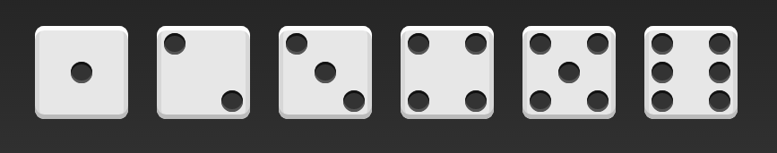

# Intro
Flex是Flexible Box的缩写，意为"弹性布局"，用来为盒状模型提供最大的灵活性。

布局的传统解决方案，基于盒状模型，依赖 display属性 + position属性 + float属性。它对于那些特殊布局非常不方便，比如，垂直居中就不容易实现。

[flex-grammar](http://www.ruanyifeng.com/blog/2015/07/flex-grammar.html)

# Grammar

采用Flex布局的元素，称为Flex容器（flex container），简称"容器"。它的所有子元素自动成为容器成员，称为Flex项目（flex item），简称"项目"。

容器默认存在两根轴：水平的主轴（main axis）和垂直的交叉轴（cross axis）。主轴的开始位置（与边框的交叉点）叫做main start，结束位置叫做main end；交叉轴的开始位置叫做cross start，结束位置叫做cross end。
项目默认沿主轴排列。单个项目占据的主轴空间叫做main size，占据的交叉轴空间叫做cross size。

- flex-direction

    决定主轴的方向（即项目的排列方向）
- flex-wrap

    如果一条轴线排不下，如何换行
- flex-flow

    是flex-direction属性和flex-wrap属性的简写形式，默认值为row nowrap
- justify-content

    定义了项目在主轴上的对齐方式
- align-items

    定义项目在交叉轴上如何对齐
- align-content

    定义了多根轴线的对齐方式。如果项目只有一根轴线，该属性不起作用、
- flex-grow 

    定义项目的放大比例，默认为0，即如果存在剩余空间，也不放大
- lex-shrink

    定义了项目的缩小比例，默认为1，即如果空间不足，该项目将缩小
- flex-basis

    定义了在分配多余空间之前，项目占据的主轴空间（main size）。浏览器根据这个属性，计算主轴是否有多余空间。它的默认值为auto，即项目的本来大小
- flex

   是flex-grow, flex-shrink 和 flex-basis的简写，默认值为0 1 auto
- align-self

  允许单个项目有与其他项目不一样的对齐方式，可覆盖align-items属性。默认值为auto，表示继承父元素的align-items属性，如果没有父元素，则等同于stretch

  # Demo
  